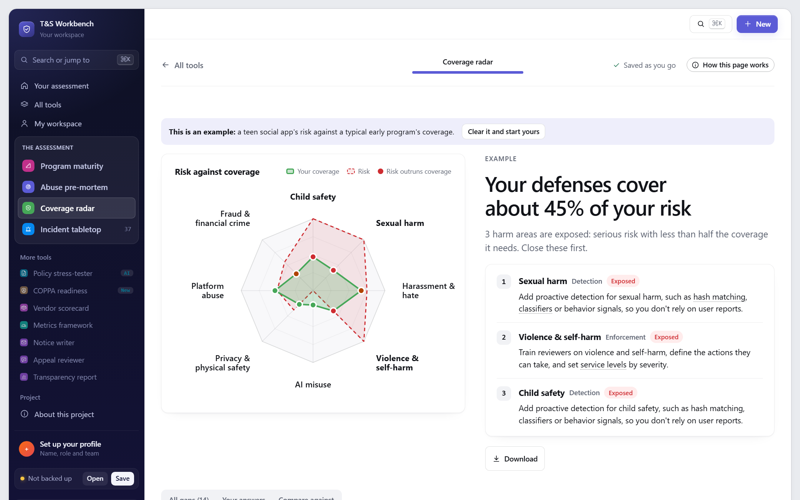
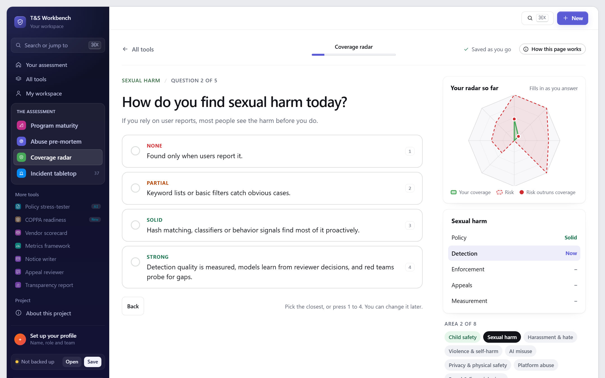
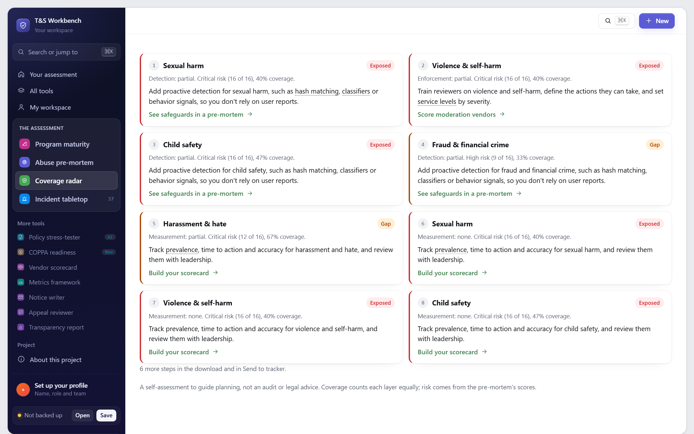
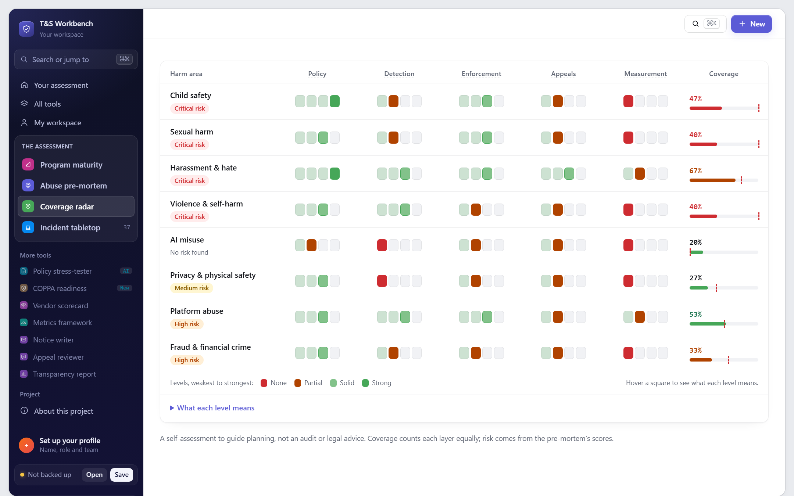

# Harm Coverage Radar

> **Where is your risk highest and your coverage thinnest?**

Rate five layers of defense (policy, detection, enforcement, appeals and measurement) for each of 8 kinds of harm, then see them on a radar against your products' risk from the abuse pre-mortem. Where risk outruns coverage, it names the weakest layer and the next step.

**[Try it live](https://stevenmacchia.com/ts-workbench/#coverage)** · part of [T&S Workbench](https://github.com/stevenmacchia/ts-workbench) · free, no sign-up

## The problem

Most programs can say what harms they worry about, and separately what defenses they have. Few can show the two side by side, so budget follows whoever argues loudest rather than where the exposure is. A child-safety policy with no proactive detection looks fine on paper until something goes wrong.

## How it works

1. **Choose the risk.** All your products combined (the worst risk in each area), one product, or an example. Harm areas that can't happen on your platform can be left out, and that's saved in your company profile.
2. **Rate your defenses.** One question at a time: for each kind of harm, five plain questions about policy, detection, enforcement, appeals and measurement, in the words of your kind of platform (a marketplace is asked about scam listings, a dating app about romance scams). Your radar fills in as you answer, with a result after each harm area. Or answer everything in one table.
3. **Close the gaps.** Exposed and under-covered areas, ranked, with the next step and the tool that helps.

Send the gaps to Jira, Asana or Linear as a CSV, or open each as a pre-filled Jira, Linear or GitHub issue.

## What's in this repo

The tool's knowledge, published as open content you can read, reuse and adapt.

| File | What it is |
|---|---|
| [`coverage-model.md`](coverage-model.md) | Harm areas, the five layers and what each level looks like |
| [`gap-playbook.md`](gap-playbook.md) | The next step for each weak layer |
| [`worksheet.md`](worksheet.md) | A printable rating grid |
| [`data/coverage-model.json`](data/coverage-model.json) | The model as JSON |

## Use it for

- Deciding where the next safety hire or vendor dollar goes
- Board and leadership updates that show exposure, not activity
- Launch reviews: does coverage exist for this product's worst risks?
- Regulator conversations about how you manage systemic risk

## More screenshots

## License and credit

Content in this repo is licensed [CC BY 4.0](LICENSE): reuse and adapt it freely, with credit. The tool's source code is in [ts-workbench](https://github.com/stevenmacchia/ts-workbench) under the MIT license.

Built by [Steven Macchia](https://www.linkedin.com/in/stevenmacchia), Trust & Safety leader, with AI-assisted development (Claude).
